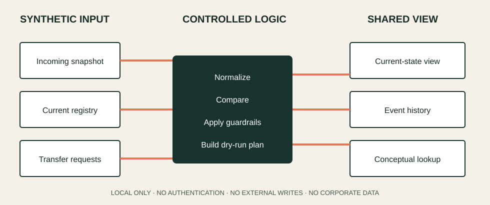

# Vehicle Operations Traceability Platform

> Conceptual, sanitized case study about operational visibility and stakeholder coordination. It is not an employer system, product export or production implementation.

**Business focus:** Commercial operations · Process visibility · Decision support · Stakeholder alignment  
**Methods and tools:** Process mapping · Power Platform concepts · Python · Synthetic data · Lean Thinking

[Professional portfolio](https://julyagoncalves21.github.io/) · [GitHub profile](https://github.com/JulyaGoncalves21)

## Executive summary

Commercial and operational teams need a reliable shared view of vehicle movement status while coordinating internal areas, dealerships, logistics partners and leadership. Fragmented updates make traceability and timely follow-up harder.

This repository demonstrates a transferable approach to that problem: define a current-state registry, preserve an event history, relate transfer context and create a simple lookup experience. Every record, name, date and location is fictional. The executable code is local-only and cannot authenticate or write to an external system.

## Business challenge

- Status information can be distributed across people and routines.
- Different stakeholders need the same event definitions and current state.
- Informal follow-up makes ownership and traceability harder.
- A useful interface depends on data governance, not only screen design.

## My contribution

The case study reflects work across business framing, requirements understanding, process visibility and solution development using automation-oriented tools. The public version documents the problem-solving method—not any confidential implementation.

## Conceptual solution

1. Receive a synthetic snapshot of current vehicle states.
2. Normalize and compare the snapshot with a synthetic registry.
3. Apply guardrails before producing a reviewable dry-run plan.
4. Derive an immutable conceptual event history from relevant changes.
5. Combine current state, event history and transfer context in a documented lookup layer.



The [solution overview](docs/solution-overview.md), [data dictionary](docs/data-dictionary.md) and [security boundaries](docs/security-boundaries.md) describe the model in more detail.

## Business value

The approach creates a common view of movement status, reduces dependence on informal status checks and supports better-informed coordination. This public demonstration claims no operational performance metric.

## Safe public demonstration

```bash
python -m venv .venv
python -m pip install -e .
python -m chassis_platform.cli
```

The command reads only the CSV fixtures under `sample-data/` and writes a local dry-run plan under ignored `output/`. It performs zero external writes.

## Repository map

```text
src/chassis_platform/  local-only normalization, planning and event logic
tests/                 behavior tests
sample-data/           invented vehicle and transfer records
power-apps/            generic, non-connected interface documentation
docs/                  architecture, dictionary and security boundaries
site/                  static case-study page built from synthetic content
```

## Security and limitations

- No real VIN/chassis number, plate, route, person, customer or operational volume.
- No MSAPP, corporate adapter, internal schema, URL, list name, tenant ID or credential.
- No original spreadsheet, PDF, screenshot, document template, log or output.
- Generic Power Fx is illustrative and cannot connect to a private environment.
- The public data model is deliberately simplified and is not deployment-ready.

Read [SECURITY.md](SECURITY.md) and [PUBLIC_RELEASE_AUDIT.md](PUBLIC_RELEASE_AUDIT.md) before reuse.

## What I learned

Operational visibility depends as much on event definitions, ownership and stakeholder adoption as it does on the interface. Separating the reusable method from confidential implementation details is part of responsible solution design.

---

# Português

## Plataforma de Operações de Chassis

> Estudo de caso conceitual e sanitizado sobre visibilidade operacional e coordenação de stakeholders. Não é um sistema corporativo, exportação de produto ou implementação de produção.

## Resumo executivo

Equipes comerciais e operacionais precisam de uma visão compartilhada e confiável do status de movimentação de veículos enquanto coordenam áreas internas, concessionárias, parceiros logísticos e liderança. Atualizações fragmentadas dificultam rastreabilidade e acompanhamento no momento certo.

Este repositório demonstra uma abordagem transferível para o problema: definir um registro de estado atual, preservar histórico de eventos, relacionar contexto de transferências e criar uma experiência simples de consulta. Todos os registros, nomes, datas e locais são fictícios. O código executável funciona somente de forma local e não pode autenticar ou escrever em sistemas externos.

## Desafio de negócio

- Informações de status podem ficar distribuídas entre pessoas e rotinas.
- Stakeholders diferentes precisam das mesmas definições de evento e estado atual.
- Acompanhamento informal dificulta responsabilidade e rastreabilidade.
- Uma boa interface depende de governança de dados, não apenas do desenho de telas.

## Minha contribuição

O estudo reflete atuação no enquadramento do problema de negócio, entendimento de requisitos, visibilidade do processo e desenvolvimento de solução com ferramentas de automação. A versão pública registra o método de resolução — não uma implementação confidencial.

## Solução conceitual

1. Receber um recorte sintético do estado atual dos veículos.
2. Normalizar e comparar o recorte com um registro fictício.
3. Aplicar controles antes de produzir um plano de simulação revisável.
4. Derivar um histórico conceitual e imutável dos eventos relevantes.
5. Combinar estado atual, histórico e contexto de transferências em uma camada documentada de consulta.

## Valor de negócio

A abordagem cria uma visão comum do status de movimentação, reduz dependência de consultas informais e apoia uma coordenação mais bem informada. Esta demonstração pública não reivindica métricas operacionais.

## Segurança e limitações

Somente dados sintéticos e locais fictícios são usados. Não há chassis/VIN real, placa, rota, pessoa, cliente, volume operacional, MSAPP, adaptador corporativo, esquema interno, URL, nome de lista, identificador de ambiente, credencial, planilha, PDF ou screenshot original. O modelo é simplificado e não está pronto para implantação.

## Aprendizado

Visibilidade operacional depende tanto de definições de eventos, responsabilidade pelo dado e adoção dos stakeholders quanto da interface. Separar o método reutilizável dos detalhes confidenciais também faz parte do desenho responsável da solução.
